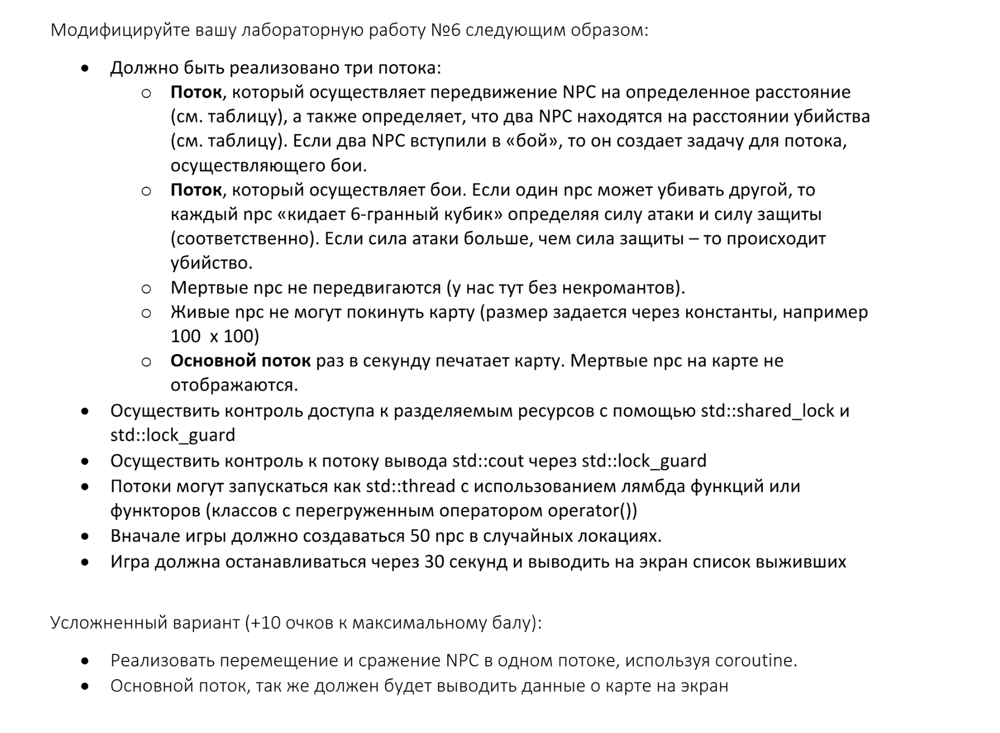

# ООП Лабораторная работа №7

М8О-211БВ-24: Губеев Давид Илембаевич
## Задание:
Вариант 19


### Объекты
- Медведь
- Выпь
- Выхухоль

### Правило совместимости
- Медведь ест всех кроме медведей
- Выпь никого не обижает
- Выхухоль убивает медведей (потому что она наш эндемик, а медведи они всякие бывают)

### Таблица убиваемости
| Кто нагоняет          | Расстояние хода | Расстояние убийства |
|-----------------------|-----------------|---------------------|
| **Медведь**           | 5               | 10                  |
| **Выпь**              | 50              | 10                  |
| **Выхухоль**          | 5               | 20                  |

## Клонирование репозитория

```bash
git clone https://github.com/Dearale/OOP_Lab_7.git
```
## Запуск программы
```
mkdir build
cd build
cmake ..
make
./main_exe  # запуск программы
./tests      # запуск тестов
```
